# briskly
A simple offline reading list made with iOS Shortcuts. 

<h2>Why?</h2>

I did not like the way Safari's reading list was hidden into the app. Moreover, only some websites could be make available for offline use. Being reliant on links and offline copies for work and not finding any app that completely suited my needs, I tried to create it with iOS Shortcuts.  
It is the first <i>real</i> shortcut I made with this app, and so it was more of an educational process at first. After a while, I realized it was functioning quite nicely and so I decided to start a real project.  

<h2>Features</h2>
<ul>
 <li>Saving web URLs to open when online;</li>
 <li>Saving webpages in HTML using iOS Shortcuts own "make HTML" action for offline use;</li>
 <li>Retrieving saved webpages for offline use;</li>
 <li>Creating and editing lists of links.</li>
</ul>

## Install guide

<h2>Screenshots</h2>
<table>
 <tr>
  <th>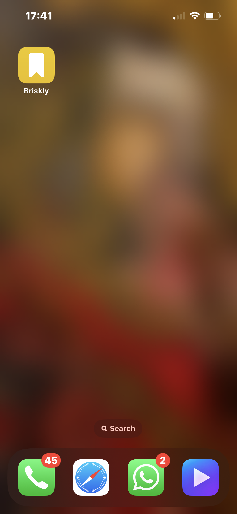</th>
  <th>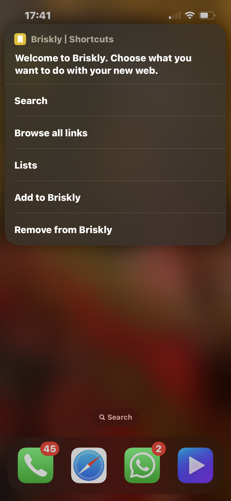</th>
  <th>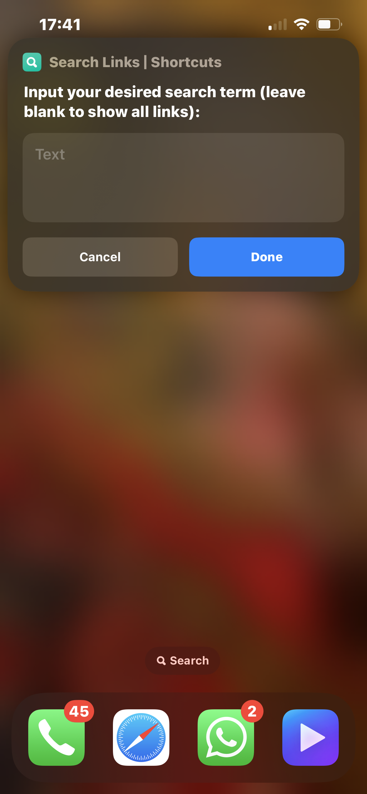</th>
 </tr>
 <tr>
 <th>Run from home screen</th>
  <th>Main menu</th>
  <th>Search box</th>
 </tr>
</table>

<table>
  <tr>
  <th></th>
  <th></th>
  <th>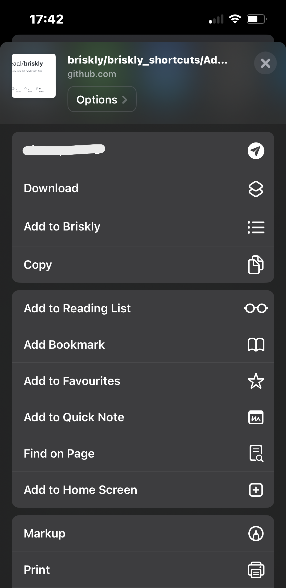</th>
 </tr>
 <tr>
  <th>Browse lists</th>
  <th>Bulk delete</th>
  <th>"Add to Briskly" in share menu</th>
 </tr>
</table>

<table>
 <tr>
  <th>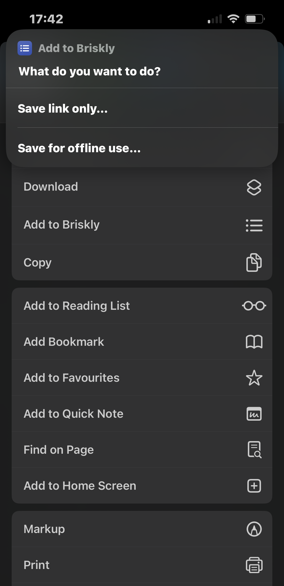</th>
  <th>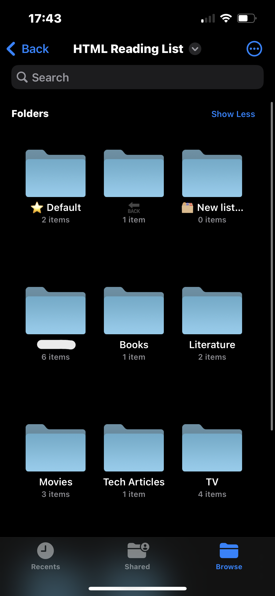</th>
  <th>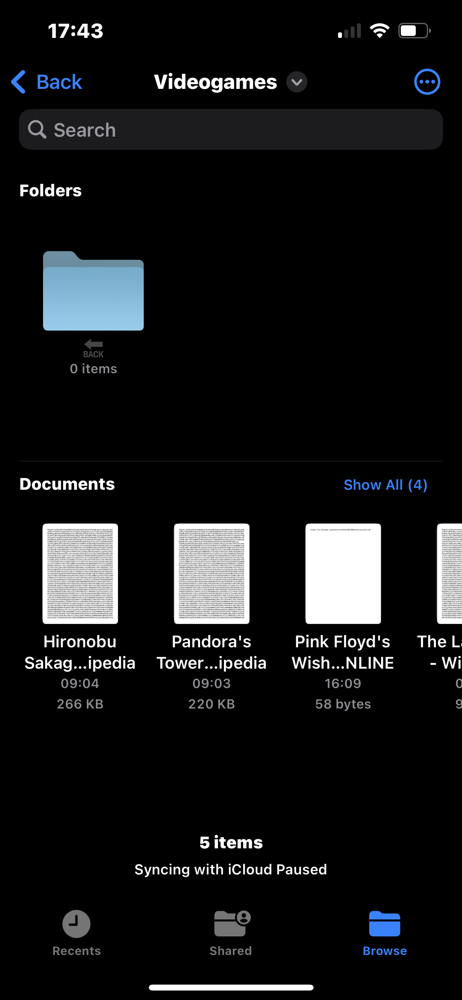</th>
 </tr>
 <tr>
  <th>"Add to Briskly" meny</th>
  <th>File structure</th>
  <th>Lists structure</th>
 </tr>
</table>

<table>
 <tr>
 <th>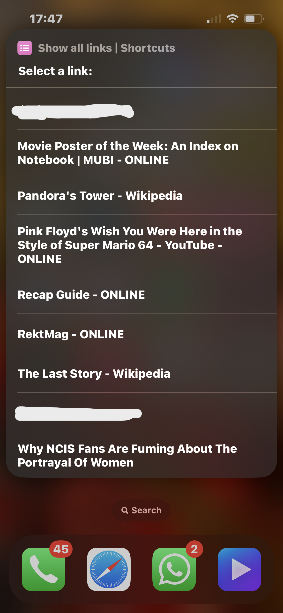</th>
  <th>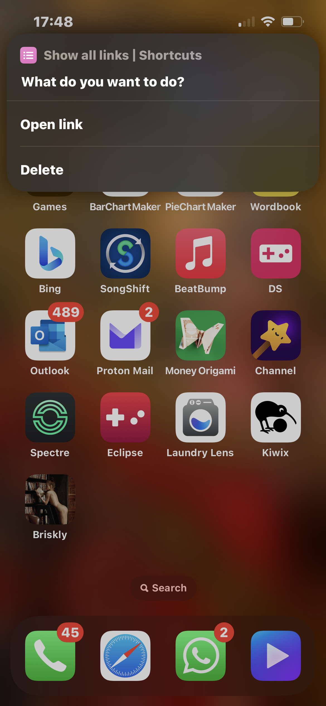</th>
  <th>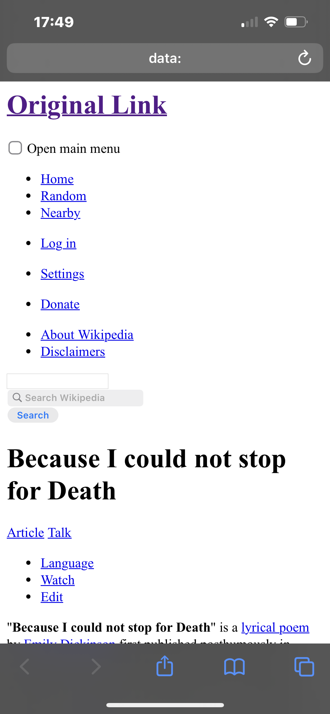</th>
 </tr>

  <tr>
  <th>Show all Links</th>
  <th>Open link actions</th>
  <th>Example: Wikipedia</th>
 </tr>
</table>

<table>
 <tr>
  <th>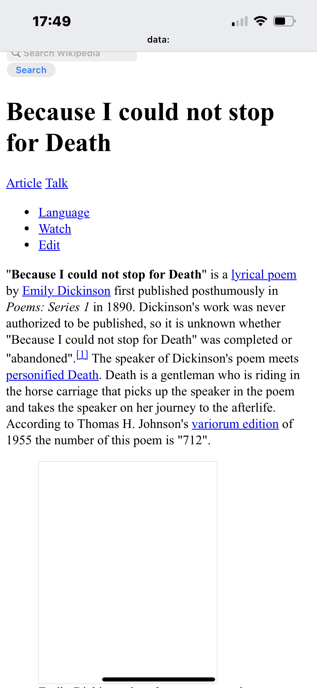</th>
 </tr>

  <tr>
  <th>Example: Wikipedia</th>
 </tr>
</table>

<h2>Checklist</h2>
 - [ ] Fix "back" menu redundancy
 - [ ] Merge shortcuts into one
 - [ ] Add page-specific rules for HTML formatting
	 - [ ] Wikipedia
	 - [ ] other most common websites...
  - more to come while I test the shortcut...

## Comments
<ul>
 <li>As you can see, I was not aware of how to navigate complex menus using dictionaries instead of running copies of the shortcut. This will be the first thing to address in next version. </li>
 <li>The "Make HTML" action is great but the output differs from website to website. Some pages, like Wikipedia (see screenshots), need extra HTML corrections. Another thing to improve in the future, starting with the most common websites. </li>
</ul>

<h2>Personal disclaimer</h2>
I do not know how much time I can spend on this and when future improvements will be released. Still, I will try to work on it as much as possible.
